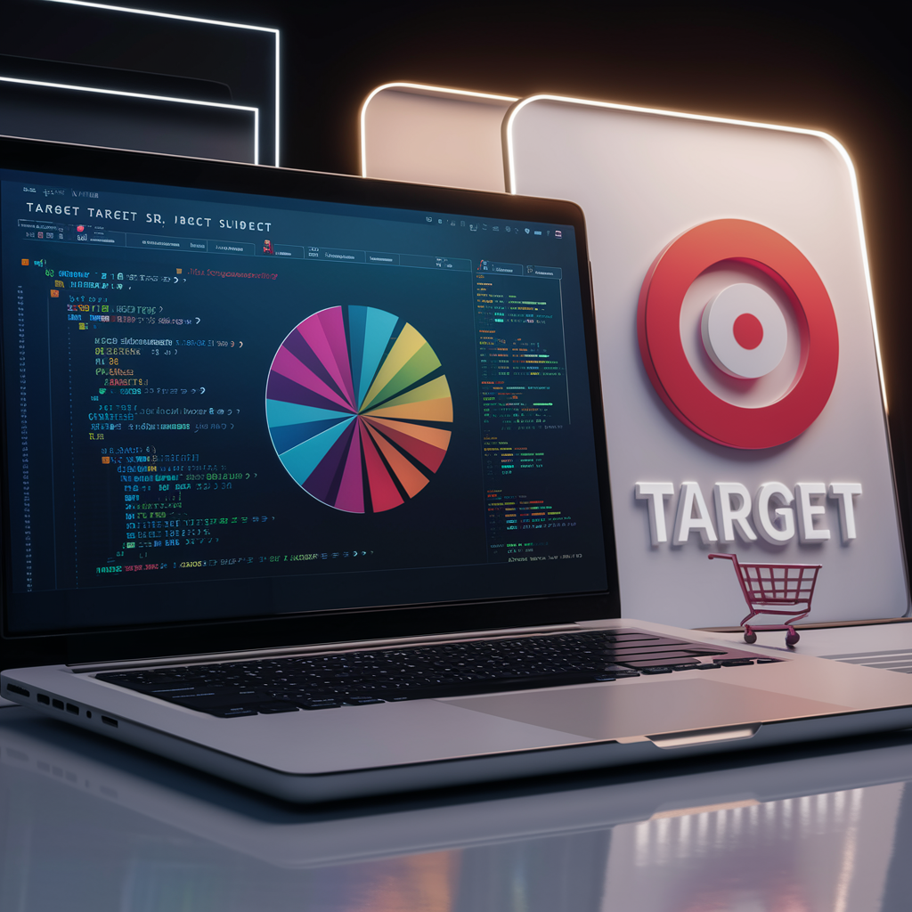

# 📊 Target Business Case Study using BigQuery SQL

## 🎯 Project Overview

This project analyzes Target's operations in Brazil, focusing on 100,000 orders placed between 2016 and 2018. Using BigQuery SQL, we dive deep into various aspects of the business, including order status, pricing, payment and freight performance, customer location, product attributes, and customer reviews.

## 🔍 Key Insights

1. **📅 Time Range**: Orders span from April 9th, 2016, to October 17th, 2018 (2 years, 25 months, 773 days).
2. **🌎 Geographic Reach**: Customers from 27 distinct states and 4,119 unique cities.
3. **📈 Order Trends**: Consistent upward trajectory in order volume throughout the year.
4. **🕒 Peak Order Times**: Brazilian customers tend to place more orders during the afternoon.
5. **💰 Economic Impact**: 137% growth rate in order value from 2017 to 2018 (Jan-Aug).
6. **🚚 Delivery Performance**: Average delivery time is 12 days, with potential for improvement.

## 🛠 Technologies Used

- Google BigQuery
- SQL
- Data Analysis Techniques

## 📊 Key Analyses

1. **Exploratory Data Analysis**
   - Data structure and characteristics
   - Time range analysis
   - Geographic distribution of customers

2. **Order Trend Analysis**
   - Year-over-year growth
   - Monthly seasonality
   - Time-of-day preferences

3. **Economic Impact Analysis**
   - Order price trends
   - State-wise total and average order values
   - Freight value analysis

4. **Delivery Performance Analysis**
   - Delivery time calculation
   - Estimated vs. actual delivery date comparison
   - State-wise delivery time analysis

5. **Payment Analysis**
   - Month-on-month orders by payment type
   - Orders by payment installments

## 💡 Key Recommendations

1. Reduce average delivery time from 12 days to 6 days to stay competitive.
2. Optimize carrier initiation (currently 2.5 days) and order approval (0.26 days) processes.
3. Focus on improving delivery speed in northern Brazil to unlock new customer segments.
4. Introduce specialized products for adventure and survival enthusiasts, targeting the northern region's unique attractions.
5. Investigate and improve quality for product categories with low review scores, especially in Bed Bath Table, Furniture Decoration, Health Beauty, and Sport Leisure.

## 🚀 Future Scope

- Implement machine learning models for demand forecasting
- Develop a real-time dashboard for monitoring key performance indicators
- Conduct a deeper analysis of customer segmentation and personalization opportunities

## Contact

For more projects and information, visit my portfolio: [https://kartikey-vyas-ds.github.io/]

If you have any feedback/are interested in collaborating, please reach out to me at  &nbsp; <a href="mailto:kvsvyas@gmail.com"> 

## License

[MIT](https://choosealicense.com/licenses/mit/)
---
